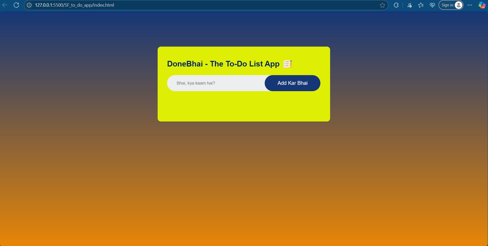

# DoneBhai - The To-Do App✅

> Bhai, kaam likh le... warna bhool jayega!

**DoneBhai** is a desi, meme-flavored, no-database to-do list web app built using simple **HTML**, **CSS**, and **JavaScript**. It’s fast, funny, and functional — just like your favourite jugaadu friend.

---

## 🚀 Features

- 📝 Add tasks with full **"Bhai" energy**
- ✅ Mark tasks as done (and feel productive for once)
- ❌ Delete tasks with zero guilt
- 🎨 Clean, responsive UI
- 🇮🇳 Memefied Hinglish vibe throughout the app

---

## 📸 Preview

  
> _Screenshot of the DoneBhai app UI_

---

## 🛠️ Tech Stack

- **HTML** – for the structure  
- **CSS** – for that clean, minimal, swagat wala design  
- **JavaScript** – for logic, DOM manipulation & task tracking  
- **Vanilla Vibes Only** – no frameworks used

---

## 📂 Project Structure

DoneBhai/
- ├── index.html
- ├── style.css
- ├── script.js
- ├── images/
- │ └── screenshot.png
- │ └── checked.png
- │ └── unchecked.png
- │ └── icon.png
- └── README.md

---

## 🤓 How to Use

1. Clone the repo:
   ```bash
   git clone https://github.com/your-username/DoneBhai.git
2. Open index.html in your browser.
3. Start adding tasks. Don’t ghost them like your responsibilities.

---

## 📢 Meme-ified UI Elements
- Add Task Field: "Bhai, kya kaam hai?"
- Add Button: "Add Kar Bhai"
- Empty List Message: "Bhai... tu kya kar raha hai?, likh kuch"

Customize them further in index.html or script.js if you're feeling creative.

## 🤝 Contribute?
If you’ve got better memes or smarter features, feel free to fork and PR. Let’s make productivity fun again.

---

## 🙌 Special Thanks
To Ashneer Grover and every Indian mom who ever said,
"Kaam likh le beta, warna bhool jayega."
